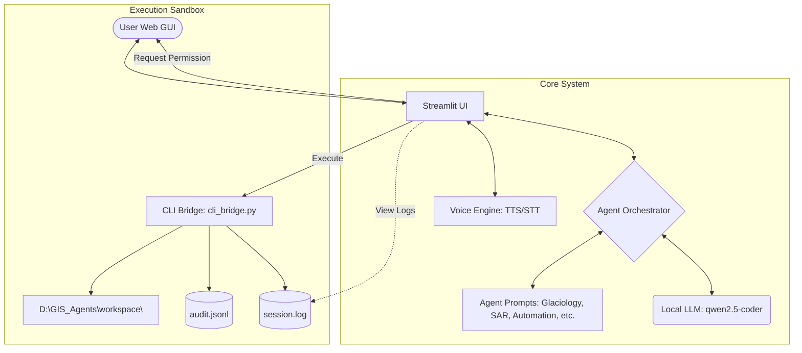

# 🏔️ Himalayan GIS Agent Swarm

An intelligent, local multi-agent system designed for geospatial computing, remote sensing analysis, data acquisition, and hydraulic/glaciology modeling in high-altitude environments. Built using Python, Streamlit, and local Large Language Models (LLMs) via Ollama.

This system provides a beautiful, real-time web UI that coordinates several specialized GIS agents to safely execute spatial commands, fetch satellite data, script geospatial routines, and interact with desktop tools (like QGIS and HEC-RAS) via a secure, audited CLI sandbox.

---

## 📐 Architecture Overview



The system is split into three main layers:

1. **User Interface (`gui.py`)**: A modern, feature-rich Streamlit web application providing agent chat, real-time terminal progress streaming, a local download folder status manager, and a text-to-speech/speech-to-text engine.
2. **Orchestration (`core/orchestrator.py`)**: An intelligent routing router that matches the user's natural language queries (using regex + LLM matching) and directs them to the optimal expert agent.
3. **Execution Sandbox (`core/cli_bridge.py`)**: A hardened gatekeeper. It is the **only** module that interacts with the operating system. It executes code and CLI commands inside a sandbox folder, audits all operations in `audit.jsonl`, and prints commands to a console permission prompt before execution.

---

## 🤖 Available Specialist Agents

Each agent has a customized prompt configuration located in `agents_config/` tailored with specific system contexts, libraries, and instructions:

- 🗺️ **Geo-Viz Expert**: Specializes in map production, cartographic plots, and visualization tools (matplotlib, contextily, folium).
- 📡 **SAR/InSAR Expert**: Focuses on radar processing, Sentinel-1 pipelines, deformation tracking, coherence analysis, and MintPy interfaces.
- 🧊 **Glaciology Expert**: Focuses on glacier outlines, snow water equivalent (SWE), glacier lake outburst floods (GLOF), moraines, and snow/ice dynamics.
- 🌊 **GLOF & Hydraulic Expert**: Focuses on HEC-RAS modeling, flood routing, dam breach parameterization, and `r.avaflow` simulations.
- 🔧 **GIS Automation Expert**: Automates desktop operations using PyQGIS scripts, ArcPy workflows, and GRASS GIS commands.
- 📊 **Data Engineering Expert**: Handles big spatial data formats, optimizing COGs, GeoParquet, STAC metadata, and heavy re-projecting/mosaicking via GDAL.
- 🐍 **Python Geospatial Expert**: Focuses on Google Earth Engine (GEE), `geemap`, complex APIs (OSMnx, Sentinelsat, CDS/ERA5), and multidimensional array manipulations (`xarray`, `rioxarray`, `numpy`).
- ⚙️ **System Guardian**: Manages files, system logs, backups, and workspace structures.

---

## 🛡️ Security Gate & Sandboxing

The swarm is designed with a **safety-first** philosophy for local code execution:
* **The Sandbox**: All file modifications and scripting operations are anchored inside `D:\GIS_Agents\workspace\`. The `cli_bridge.py` rejects any path traversal attempt (e.g., `..`) that escapes this folder.
* **Permission Prompts**: Before dangerous operations (writing files, running Python, or running CLI tools) are performed, the CLI bridge blocks and waits for a console confirmation.
* **Security Gate**: The Streamlit interface is protected by a password input wall at startup to ensure public Cloudflare tunnels do not expose your system to unauthorized users.
* **Blacklists**: Any commands containing blacklisted patterns (like `rm -rf`, `format`, `os.system`) are blocked automatically.

---

## 🚀 Getting Started

### 📋 Prerequisites

1. **Python 3.10+** (tested on Windows 11).
2. **Ollama**: Download and install [Ollama](https://ollama.com). Pull the target model:
   ```bash
   ollama pull qwen2.5-coder:7b
   ```
3. **External Dependencies** (Optional but highly recommended):
   - QGIS 3.x (to run PyQGIS automation scripts)
   - HEC-RAS (to execute river modeling plans)

### ⚙️ Installation

1. Clone this repository (or copy the files) to `D:\GIS_Agents\`.
2. Install the Python dependencies:
   ```bash
   pip install streamlit requests pyttsx3 SpeechRecognition earthengine-api geemap sentinelsat osmnx elevation cdsapi xarray rioxarray dask
   ```

### 💻 Running the App

To run the Streamlit GUI locally:
```bash
python launch_gui.py
```
This starts the Streamlit server at `http://localhost:8501`.

### 🌐 Exposing the GUI Publicly (Cloudflare Tunnel)

To access your GIS workspace and control your agents from another device (like a tablet or phone in the field):

1. Expose it via a temporary public URL using the pre-packaged script:
   ```bash
   double-click start_public.bat
   ```
   This will download `cloudflared` (if missing), spin up a secure, random `.trycloudflare.com` tunnel, and print the public link in your console.
2. Enter the default security password `himalaya` (defined in `gui.py`) to unlock the portal.

---

## 🛠️ Configuration & Customization

### Security Password
To change the access password:
1. Open `gui.py`.
2. Locate the **Security Gate** section:
   ```python
   if password == "himalaya":  # Change "himalaya" to your secret password
   ```

### Adding New Tools
To add new features or external command integrations to the CLI bridge:
1. Open `core/cli_bridge.py`.
2. Implement your tool wrapper function.
3. Expose it to the LLM by adding it to the `TOOLS` mapping dict at the bottom of the file.

---

## 🔮 Future Recommendations

1. **Database Chat Persistence**: Currently, chat histories reside in Streamlit's session state. Adding a lightweight SQLite backend will allow users to review past agent conversations across browser sessions.
2. **Web-Based Permission Console**: Move the `y/n` prompt from the terminal shell directly into the Streamlit UI to avoid having to check the host console to approve script executions.
3. **Multi-User Isolation**: Implement individual sandbox workspaces per user token to support collaborative GIS work without file-overwrite collisions.
4. **Enhanced Voice Control**: Improve voice integration to support speech-to-text directly via WebRTC in the browser, rather than using the host machine's local microphone (which only works when hosting locally).
