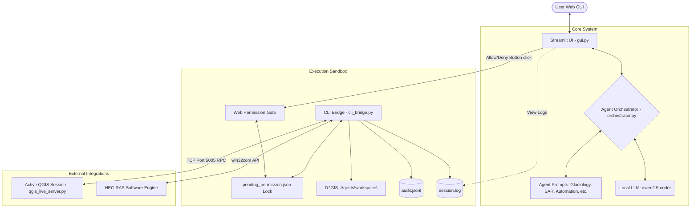

# 🏔️ Himalayan GIS Agent Swarm

An intelligent, local multi-agent system designed for geospatial computing, remote sensing analysis, data acquisition, and hydraulic/glaciology modeling in high-altitude environments. Built using Python, Streamlit, and local Large Language Models (LLMs) via Ollama.

This system provides a beautiful, real-time web UI that coordinates several specialized GIS agents to safely execute spatial commands, fetch satellite data, script geospatial routines, and interact with desktop tools (like QGIS and HEC-RAS) via a secure, audited CLI sandbox.

---

## 📐 Architecture Overview



The system is split into three main layers:

1. **User Interface ([gui.py](file:///d:/GIS_Agents/gui.py))**: A modern, feature-rich Streamlit web application providing agent chat, real-time terminal progress streaming, a local download folder status manager, interactive map previews, and an Area of Interest (AOI) uploader.
2. **Orchestration ([core/orchestrator.py](file:///d:/GIS_Agents/core/orchestrator.py))**: An intelligent routing manager that matches the user's natural language queries (using regex + LLM matching) and directs them to the optimal expert agent.
3. **Execution Sandbox ([core/cli_bridge.py](file:///d:/GIS_Agents/core/cli_bridge.py))**: A hardened gatekeeper. It is the **only** module that interacts with the operating system. It executes code and CLI commands inside a sandbox folder, audits all operations in `audit.jsonl`, and gates all executing commands via a non-blocking Web Permission Gate.

---

## 🚀 Key Implemented Features

### 1. 🔑 Web-Based Permission Gate
* **The Problem**: Traditional console-based inputs (`input("Allow? [y/n]")`) block execution threads, causing Streamlit web interfaces to freeze or hang indefinitely without user visibility.
* **The Solution**: Implemented a non-blocking file-based handshake. When a dangerous action (e.g. running Python, executing a shell command, downloading a file) is requested:
  1. The CLI bridge writes the request metadata to [workspace/temp/pending_permission.json](file:///d:/GIS_Agents/workspace/temp/pending_permission.json) and polls it in short sleep loops.
  2. The Streamlit UI displays a warning banner showing the action details alongside **Approve** and **Deny** buttons.
  3. Clicking Approve updates the JSON file status to `"allowed"`, which unblocks the CLI bridge and resumes execution instantly. 

### 2. 🖥️ QGIS "Live Link" RPC Console
* **The Problem**: Opening a new QGIS desktop window for every single Python script run is slow, resource-heavy, and loses active layer selections or project state.
* **The Solution**: Created [qgis_live_server.py](file:///d:/GIS_Agents/qgis_live_server.py), a local TCP RPC server running on Port `5005`.
  * When copy-pasted into the active QGIS Python Console, it spawns a daemon listening thread.
  * When the `GIS Automation Expert` writes PyQGIS code, `cli_bridge.py` sends the code payload directly over TCP.
  * QGIS executes the code in the context of the open desktop session, rendering layers, shapefiles, and raster stylings live on screen.
  * A sidebar QGIS active layer list continuously queries the active QGIS project, synchronizing layers and attributes, and automatically injecting them into the agent's LLM system prompt.

### 3. 🗺️ Interactive Web GIS Map Previews
* **The Solution**: Embedded `folium` and `streamlit-folium` directly into the Streamlit chat bubbles. 
  * The system dynamically parses agent and user messages for workspace paths ending in spatial formats (`.geojson`, `.shp`, `.gpkg`, `.kml`, `.tif`, `.tiff`).
  * If found, the application reads the vector geometries (reprojecting to WGS84 EPSG:4326 via Geopandas) or extracts raster boundaries (via Rasterio) and displays an interactive, slippy map directly inside the message history.

### 4. 📂 Area of Interest (AOI) Spatial Uploader
* **The Solution**: A sidebar drag-and-drop file uploader supporting GeoJSON, KML, and zipped Shapefiles.
  * Zipped Shapefiles are automatically unpacked to a dedicated sub-folder.
  * Once uploaded, the file path is pinned to the session state, rendering the AOI boundary on a compact sidebar map.
  * An automated system notification is appended to the active agent conversation:
    > *[SYSTEM NOTIFICATION] User uploaded a new Spatial AOI file at workspace/... Please read this file using geopandas to get coordinates.*

### 5. 🌊 GLOF & Dam Breach Simulator Dashboard
* **Empirical Parameter Calculator**: Dynamically calculates breach parameters (average breach width $B_{avg}$, formation time $t_f$, and peak outflow $Q_p$) using classic moraine/dam breach equations:
  - **Froehlich (2008)**
  - **MacDonald & Langridge-Monopolis (1984)**
  - **Von Thun & Gillette (1990)**
* **HEC-RAS COM Automation**: Runs unsteady-flow computations in the background using `win32com.client` class dispatches (e.g., `RAS631.HECRASController`), returning simulation outputs directly to the UI.
* **GDAL DEM Product Generator**: A GUI interface to process raw elevation TIFFs and automatically output Slope maps, Aspect maps, Hillshades, and vector Contour line shapefiles.

---

## 🤖 Available Specialist Agents

Each agent has a customized prompt configuration located in `agents_config/` tailored with specific system contexts, libraries, and instructions:

- 🗺️ **Geo-Viz Expert**: Specializes in map production, cartographic plots, and visualization tools (matplotlib, contextily, folium).
- 📡 **SAR/InSAR Expert**: Focuses on radar processing, Sentinel-1 pipelines, deformation tracking, coherence analysis, and MintPy interfaces.
- 🧊 **Glaciology Expert**: Focuses on glacier outlines, snow water equivalent (SWE), glacier lake outburst floods (GLOF), moraines, and snow/ice dynamics.
- 🌊 **GLOF & Hydraulic Expert**: Focuses on HEC-RAS modeling, flood routing, dam breach parameterization, and `r.avaflow` simulations.
- 🔧 **GIS Automation Expert**: Automates desktop operations using PyQGIS scripts, ArcPy workflows, and GRASS GIS commands.
- 📊 **Data Engineering Expert**: Handles big spatial data formats, optimizing COGs, GeoParquet, STAC metadata, and heavy re-projecting/mosaicking via GDAL.
- 🐍 **Python Geospatial Expert**: Focuses on Google Earth Engine (GEE), `geemap`, complex APIs (OSMnx, Sentinelsat, CDS/ERA5), and multidimensional array manipulations (`xarray`, `rioxarray`, `numpy`).
- ⚙️ **System Guardian**: Manages files, system logs, backups, and workspace structures.

---

## 🛡️ Security Gate & Sandboxing

The swarm is designed with a **safety-first** philosophy for local code execution:
* **The Sandbox**: All file modifications and scripting operations are anchored inside `D:\GIS_Agents\workspace\`. The `cli_bridge.py` rejects any path traversal attempt (e.g., `..`) that escapes this folder.
* **Permission Prompts**: Before dangerous operations (writing files, running Python, or running CLI tools) are performed, the CLI bridge blocks and waits for a confirmation.
* **Security Gate**: The Streamlit interface is protected by a password input wall at startup to ensure public Cloudflare tunnels do not expose your system to unauthorized users.
* **Blacklists**: Any commands containing blacklisted patterns (like `rm -rf`, `format`, `os.system`, etc.) are blocked automatically.

---

## 🚀 Getting Started

### 📋 Prerequisites

1. **Python 3.10+** (tested on Windows 11).
2. **Ollama**: Download and install [Ollama](https://ollama.com). Pull the target model:
   ```bash
   ollama pull qwen2.5-coder:7b
   ```
3. **External Dependencies** (Optional but highly recommended):
   - **QGIS 3.x** (to run PyQGIS automation scripts)
   - **HEC-RAS** (to execute river modeling plans)

### ⚙️ Installation

1. Clone this repository (or copy the files) to `D:\GIS_Agents\`.
2. Install the Python dependencies:
   ```bash
   pip install streamlit requests pyttsx3 SpeechRecognition earthengine-api geemap sentinelsat osmnx elevation cdsapi xarray rioxarray dask pywin32 streamlit-folium geopandas rasterio pyproj pystac-client planetary-computer fiona
   ```

### 💻 Running the App

1. **Start the Streamlit GUI locally**:
   ```bash
   python launch_gui.py
   ```
   This starts the Streamlit server at `http://localhost:8501`.

2. **Activate the QGIS Live Link Bridge**:
   - Open your desktop QGIS window.
   - Go to `Plugins -> Python Console`.
   - Open the file [qgis_live_server.py](file:///d:/GIS_Agents/qgis_live_server.py) or copy its contents and run it inside the console.
   - The console will display: `[QGIS LIVE LINK ACTIVE]`. The port `5005` will now be listening for PyQGIS script payloads.

3. **Verify HEC-RAS COM API Registration**:
   - Ensure HEC-RAS is installed. The script will automatically attempt to dispatch the HEC-RAS Controller COM class corresponding to your version (e.g., `RAS631.HECRASController` for version 6.3.1).

### 🌐 Exposing the GUI Publicly (Cloudflare Tunnel)

To access your GIS workspace and control your agents from another device (like a tablet or phone in the field):

1. Expose it via a temporary public URL using the pre-packaged script:
   ```bash
   double-click start_public.bat
   ```
   This will download `cloudflared` (if missing), spin up a secure, random `.trycloudflare.com` tunnel, and print the public link in your console.
2. Enter the default security password `himalaya` (defined in `gui.py`) to unlock the portal.

---

## 🔮 Future Plans & Recommendations

1. **SQLite Database Chat Persistence**: Currently, chat histories reside in Streamlit's session state and disappear upon browser refresh. Migrating chat logs to a lightweight SQLite database will allow users to review past agent conversations and audit commands across browser sessions.
2. **Browser-Based Audio (WebRTC STT)**: Replace the Python local microphone library with a browser-native audio recorder component. This allows field teams accessing the tool via Cloudflare tunnel on their mobile devices to interact via voice.
3. **GLOF Downstream Vulnerability & Impact Assessor**: Automate the impact assessment phase by scripting a zonal overlay tool. When HEC-RAS computes an inundation depth raster, the agent will intersect the flood boundaries with OpenStreetMap building footprints (extracted via `osmnx`), classifying buildings into CWC Risk categories (Low, Medium, High, Extreme) and outputting a structured PDF disaster report.
4. **Auto-Styling Cartography Engine**: Develop custom styling scripts in PyQGIS that automatically apply standard CWC/NDMA layer styling, classification colors, and contour layouts to vector outputs synced via the Live Link.
