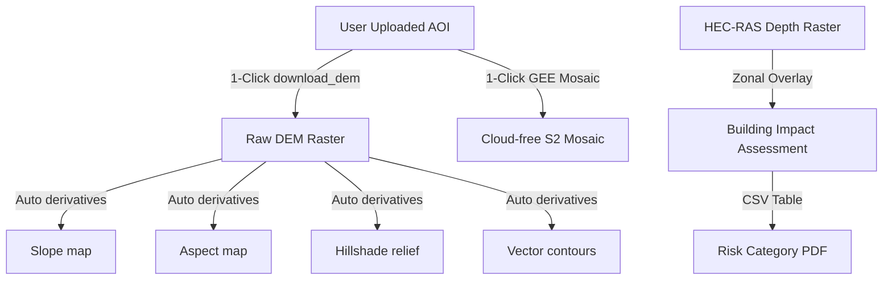

# 🗻 Future Capabilities: DEM Products, Satellite Mosaics & Hazard Analytics

Here are the most powerful capabilities we can add next to expand your system's spatial intelligence over your uploaded AOIs.

---

## 1. 📐 Automatic DEM Derivatives Engine
Currently, the agent can download a DEM (using `download_dem` which pulls SRTM or Copernicus DEM). However, the raw elevation raster is just the beginning. 

We can add a **Unified DEM Processor** tool in `cli_bridge.py`:
- **Function**: `process_dem_derivatives(dem_path, products=['slope', 'aspect', 'hillshade', 'contours'], contour_interval=50)`
- **How it works**: Uses GDAL CLI (`gdaldem`) or `rasterio` under the hood to automatically generate:
  - `slope.tif` (in degrees, useful for landslide and avalanche risk)
  - `aspect.tif` (direction the slope faces, crucial for snowpack melting models)
  - `hillshade.tif` (beautiful 3D shaded relief map)
  - `contours.shp` (vector contour lines at a set interval, e.g. 20m or 50m)
- **UI Integration**: These layers will automatically render in QGIS via your Live Link or show as interactive map previews in the chat!

---

## 2. 🛰️ GEE Sentinel-2 Cloud-Free Mosaic Pipeline
Instead of downloading individual raw imagery tiles (which are often cloudy or very large), we can give the agent a **1-click cloud-free composite tool**:
- **Function**: `create_sentinel_mosaic(aoi_path, start_date, end_date, composite_type='median')`
- **How it works**: Uses Earth Engine (`ee`) to filter Sentinel-2 Level-2A imagery over your uploaded AOI, apply a cloud-masking algorithm, calculate the median pixel values, clip the final mosaic to your AOI boundary, and export it directly to `workspace/downloads/` as a Cloud-Optimized GeoTIFF (COG).
- **Why it's powerful**: You get a clean, ready-to-use background map of your exact study area without any clouds!

---

## 3. 🌊 GLOF Downstream Vulnerability & Impact Assessor
For hydraulic and GLOF safety work, we can automate the **Impact Assessment** phase of CWC/NDMA guidelines:
- **Function**: `run_inundation_impact_assessment(depth_raster_path, buildings_shapefile_path)`
- **How it works**: Runs zonal statistics to overlay your HEC-RAS flood depth results onto a buildings or road shapefile.
- **Outputs**:
  - Calculates the maximum flood depth and velocity at each building.
  - Automatically classifies each structure into CWC Risk categories:
    - **Low Risk**: <0.3m depth (minimal danger)
    - **Medium Risk**: 0.3m – 2.0m depth
    - **High Risk**: 2.0m – 5.0m depth
    - **Extreme Risk**: >5.0m depth (structure collapse danger)
  - Exports a CSV list of all affected properties and plots a pie chart in your Streamlit dashboard summarizing the damage.

---

## 🗺️ How it would look in your Swarm Workspace:

### Which of these would you like to build next?
1. **DEM Derivatives Engine** (creates Slope, Aspect, Hillshade, and Contours automatically over your uploaded AOI).
2. **GEE Cloud-Free Satellite Mosaic** (downloads clean Sentinel-2 imagery for your AOI).
3. **GLOF Impact Assessor** (calculates building flood risk categories).
